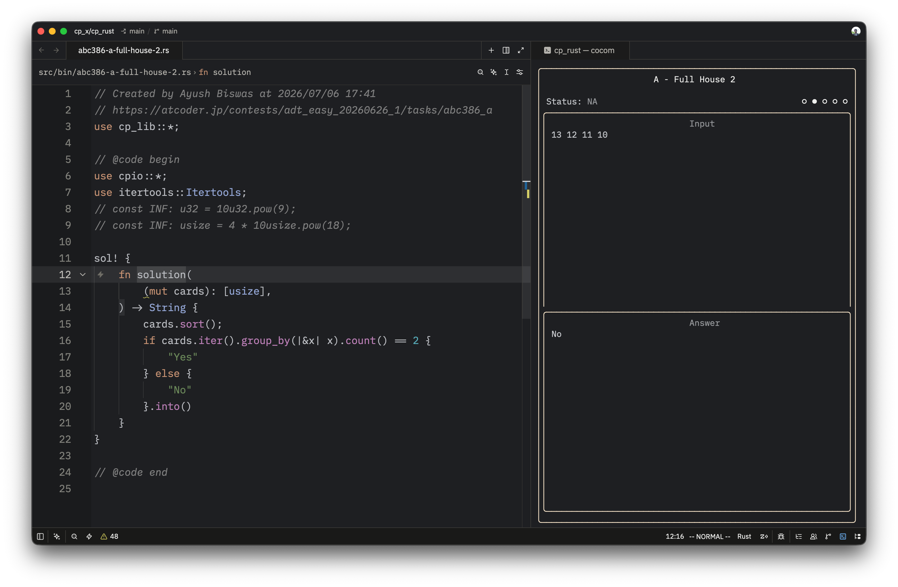

<div align="center">

# 🥥 Cocom
### The Ultimate Competitive Programming Companion TUI

[](LICENSE)

</div>

**Cocom** is a powerful, terminal-based companion for competitive programming. It seamlessly integrates with the [Competitive Companion](https://github.com/jmerle/competitive-companion) browser extension to fetch problem statements, generate smart boilerplate, resolve custom library dependencies, and locally judge your solutions against sample test cases—all without leaving your terminal.

---

## Features

- **Competitive Companion Server**: Local HTTP endpoint (`127.0.0.1:6174`) to receive problem metadata, constraints, and sample tests directly from the browser extension.
- **Regex-Based File Routing**: Maps problem URLs to local directory structures and filenames using configurable regex captures and Go templates.
- **Snippet Linker**: Parses custom `@head` and `@code` tags in your local library, topologically sorts dependencies, and merges them into the final submission payload.
- **Watch & Run**: Filesystem watcher that automatically detects file saves, compiles the code, and pipes sample tests to the binary.
- **Sandboxed Execution**: Compiles and runs code in an isolated temporary directory with strict time limits (`context.WithTimeout`) and peak memory tracking (`syscall.Rusage`).
- **Split-Pane TUI**: Bubble Tea interface with viewports to diff Input, Expected Output, Actual Output, and StdErr side-by-side.
- **Silent Logging**: Non-blocking structured logs written to the OS temp directory to debug HTTP payloads, linker graphs, and compiler `stderr`.

---

## 🎥 Demo
> *Preview with Zed*


> *Example workflow using Neovim*

> Tip: Press f to edit the file again

---

> *Example workflow using Vscode*


---

## 🚀 Installation

Ensure you have [Go](https://go.dev/dl/) installed (v1.22+ recommended).

```bash
go install github.com/veryshyjelly/cocom@latest
```

---

## 🛠️ Usage

Run `cocom` in your competitive programming workspace root.

```bash
cocom [options]
```

### CLI Options

| Flag | Description | Default |
| :--- | :--- | :--- |
| `-c`, `--config <file>` | Path to the configuration file. | `./cocom.yml` |
| `-C`, `--root <dir>` | Project root directory. | `.` (Current Dir) |
| `-d`, `--debug` | Enable verbose debug logging. | `false` |
| `-v`, `--version` | Show version information. | `false` |
| `-h`, `--help` | Show help message. | `false` |

---

## ⚙️ Configuration (`cocom.yml`)

If `cocom.yml` is not found, Cocom will prompt you to generate a starter template. Below is an example configuration for **OCaml**:

```yaml
author: YOUR_NAME_HERE

# Command to open the generated file in your favorite editor
editor: "code {{ .Filename }}" 

# Rules for generating filenames based on problem URLs
filename:
  rules:
    - site: open.kattis.com
      regex: "problems/([^/?]+)/?"
      template: "./src/bin/{{ index .Captures 1 }}.ml"
    - site: codeforces.com
      regex: "problemset/problem/([0-9]+)/([A-Za-z0-9]+)"
      template: "./src/cf/{{ index .Captures 1 }}{{ index .Captures 2 }}.ml"

# Base template for newly created files
template:
  source: ./src/main.ml
  modifier: |
    (* Created by {{ .Author }} at {{ .Time }} 
       {{ .Url }} *)
    {{ .Code }}

# Post-processor for the final submitted code
code:
  modifier: |
    {{ .Header }}
    {{ range .LibFiles }}
    (* --- {{ .Name }} --- *)
    {{ .Content }}
    {{ end }}
    {{ .Code }}

# Custom library linking
lib:
  # Regex template to detect library usage in code
  regex: "open {{ .Name }}"
  include:
    dsu: "./src/lib/dsu.ml"
    math: "./src/lib/math.ml"

# Compiler and execution settings
compiler:
  name: Ocaml
  source: "main.ml"       # Name of the sandbox file
  compile: ocamlfind      # Leave empty for interpreted languages (Python, etc.)
  args:
    - ocamlopt
    - -O2
    - -o
    - a.out
    - main.ml
    - -linkpkg
    - -thread
    - -package
    - str,num,zarith,threads,containers,core,iter,batteries
  run: ./a.out

# Behavior toggles
create_file: true   # Auto-create boilerplate file on problem fetch
run_on_save: true   # Auto-run tests when the file watcher detects changes
```

---

## ⌨️ Keybindings

| Keys | Action |
| :--- | :--- |
| `r` / `Ctrl+'` | **Run** test cases manually |
| `f` | **Create** boilerplate file |
| `c` | **Copy** solution file |
| `a` | **Add** custom test case |
| `q` / `Esc` / `Ctrl+C` | **Quit** application |
| | |
| `1` / `j` | View: **Input** & **Answer** |
| `2` / `k` | View: **Input** & **Output** |
| `3` / `l` | View: **Input** & **Error** |
| `4` / `;` | View: **Answer** & **Output** |
| | |
| `→` / `Tab` | **Next** test case |
| `←` / `Shift+Tab`| **Previous** test case |
| `?` | Toggle **Help** menu |

*(Note: Mouse scrolling and clicking are also fully supported in the split-pane viewports!)*

---

## 📂 How the Custom Linker Works

Cocom features a unique dependency linker for your personal snippet libraries, acting like a mini-compiler frontend:
1. It scans your configured `lib.include` files.
2. It uses the `lib.regex` to build a dependency graph (e.g., if `graph.ml` contains `open DSU`, it depends on `dsu.ml`).
3. It performs a **Topological Sort** (DFS) to ensure dependencies are injected before the files that need them. Detects and prevents cyclic dependencies!
4. It extracts headers (`@head begin` ... `@head end`) and code blocks (`@code begin` ... `@code end`) to cleanly merge them into your final sandbox solution without polluting your local workspace files.

---

## 🪵 Logging & Debugging

Cocom runs a comprehensive background logger to help you debug parsing, linking, or compilation issues without cluttering your TUI.
- **Location**: `<OS_TEMP_DIR>/cocom.log` (e.g., `/tmp/cocom.log` on Linux/macOS).
- **Levels**: `DEBUG` (run with `-d` flag), `INFO`, and `ERROR`.
- Logs include incoming HTTP JSON payloads, dependency graph resolutions, compilation `stderr`, and sandbox execution metrics.

---

## 🤝 Contributing

Contributions, issues, and feature requests are welcome!
Feel free to check the [issues page](https://github.com/veryshyjelly/cocom/issues).

## 📄 License

This project is licensed under the MIT License.
